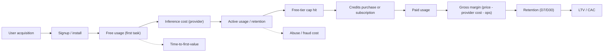

# OrbiterX — Corrective Strategic Positioning Audit

**Date:** 2026-08-10
**Scope:** Rebuild OrbiterX positioning from scratch on the corrected business model (managed AI coding agent platform — not BYOK).
**Evidence base:** Repo inspection of `/Volumes/vame/rustorbiterx` (2026-08-10); user-supplied business-model constraints; web research on competitors and market (checked 2026-08-10, sources in the appendix).

**How to read the labels used throughout:**

- **FACT** — directly supported by the repo, user-supplied constraint, or a cited source.
- **INFERENCE** — a reasonable conclusion from facts, not directly proven.
- **UNKNOWN** — we do not currently have the information.
- **REQUIRES VALIDATION** — a claim that must be tested with the first 100 users / beta data before it is used publicly or in valuation.

---

## Executive answer (before the detail)

1. **OrbiterX is a managed AI coding agent.** The client (terminal, desktop, web) runs on the user's machine; the models, routing, quotas, and billing run on OrbiterX-managed infrastructure. The user never touches a provider API key.
2. **Category:** AI coding agent. Customer-facing label: "AI coding agent." Investor-facing label: "managed AI coding agent platform."
3. **Who it is for:** serious, price-constrained developers — concentrated in India initially — who already use or want to use agentic coding tools but find $20–$200/month or provider/API management to be the barrier.
4. **The pain it solves:** serious agentic coding is either expensive, fragmented across providers, or capped by weak free tiers. Developers want one capable agent with curated model access, predictable cost, and a real free way to start.
5. **What it provides:** a capable coding agent (multi-agent, sandboxed execution, approvals, diffs, sessions), curated managed model access, free tier → low-price subscription + credits.
6. **Primary differentiator (candidate, not moat):** the combination of managed model access + curated selection + free/affordable access + parallel agents + sandboxed local execution + a single developer experience. Each element exists elsewhere; the combination is rare, but it is not yet defensible.
7. **Business model:** OrbiterX pays providers and sells managed access. Free tier (subsidized) → paid subscription + credits for premium models. Gross margin is currently UNKNOWN and must be measured.
8. **Never claim:** BYOK / bring-your-own-model / "your models" / local inference / fully local / privacy-first / no code leaves the machine / proprietary models. None are the proposition, and most are not true.
9. **The brutal answer (Part 16):** there is currently **no sufficiently strong switching reason** for the first 100 serious developers to choose OrbiterX over Cursor, Claude Code, Codex, or OpenCode. The only credible opening is a materially better free tier plus a proven-quality agent for price-constrained developers — and it must be validated, not assumed.

---

# PART 1 — PRODUCT TRUTH

## 1. What exactly is OrbiterX?

**FACT.** OrbiterX is a fork of OpenAI's Codex CLI (Apache-2.0, attribution preserved) that has been heavily re-engineered. The current architecture in the repo has two layers:

- **Client/agent layer (Rust):** an agent loop with tool calls, file edits, shell commands, approvals, sandboxed execution (macOS Seatbelt, Linux Bubblewrap, Windows Job Objects), sub-agent/multi-agent orchestration, MCP, skills, plugins, memory, session persistence, and a JSON-RPC app-server. Surfaces: CLI/TUI (`ratatui`), desktop app (Tauri; an Electron standalone also exists), web frontend (Next.js), and an app-server API for editor integrations.
- **Managed inference layer (Python):** an OpenAI-compatible gateway (FastAPI, deployed on Railway) with a dynamic model registry, per-model endpoints/keys/costs, per-IP rate limits, free-tier gating, and balance-based billing. Auth is OrbiterX-issued (OAuth issuer at `auth.orbiterxai.online` plus web-service access tokens). Models/providers referenced in the stack: Kimi (default `moonshotai/Kimi-K3`), Qwen, Step, GLM, Gemini (separate Google gateway), plus a self-hosted vLLM websocket proxy.

**FACT.** The forked Rust client still contains ChatGPT-backend paths (`chatgpt.com/backend-api/orbiterx/...` endpoints, ChatGPT plan types, analytics events) — i.e., the codebase currently carries both an inherited ChatGPT integration and the new OrbiterX gateway. This duality is real and unresolved.

**FACT.** OrbiterX does not train or own a foundation model anywhere in the repo. The `models.json` catalog contains GPT-5.x-family entries inherited from the Codex fork; the gateway layer points at third-party open-weight and commercial models.

**INFERENCE.** The intended product is a **managed AI coding agent platform**: the client executes on the user's machine, inference happens remotely through OrbiterX-managed infrastructure, and the user buys access to OrbiterX's agent plus curated model infrastructure — not raw model tokens and not provider accounts.

## 2. What category should OrbiterX compete in?

**AI coding agent** — the category currently defined by Claude Code, OpenAI Codex, and OpenCode. Not "IDE" (OrbiterX has no editor; it integrates with editors like VS Code/Cursor/Windsurf). Not "model gateway" (that is invisible plumbing). Not "AI workspace" (too diffuse). The investor-facing extension is "managed AI coding agent platform," where "platform" refers to the managed inference + orchestration + app-server stack.

## 3. IDE, coding agent, AI coding platform, or something else?

**FACT/INFERENCE.** It is a **coding agent with a platform-shaped backend**. Customer-facing: "AI coding agent" (you talk to it, it works on your repo). Investor-facing: "managed AI coding agent platform" (agent + managed models + routing + billing + app-server API). Calling it an "IDE" in the README is a category error that should be fixed.

## 4. What does the user actually receive?

**FACT.** A working agent on their repository, reachable from terminal, desktop, and browser, that can: run commands and edit files inside a sandbox with approvals; spawn multiple parallel sub-agents with live streaming; show inline diffs; persist and resume sessions; use MCP/skills/plugins; and select from curated models — **without the user supplying any provider account or API key** (managed access), starting on a free tier and moving to paid usage.

## 5. What does OrbiterX manage internally?

**FACT.** Model registry and per-model configuration (endpoints, keys, cost per 1k tokens); provider relationships; model routing decisions; free-tier gating (defaults in code: 50 requests/day/IP and 10,000 tokens/day/IP on free-flagged models); rate limits (per-IP and global); user auth (OAuth + tokens); workspace balance and billing (TiDB); conversation/session storage (Supabase/Postgres); and at least one self-hosted inference path (vLLM proxy).

## 6. What does the user NOT have to manage?

**FACT/INFERENCE.** Provider accounts, provider API keys, billing relationships with multiple AI vendors, per-provider rate-limit juggling, cost tracking across providers, and model procurement. The curated registry means OrbiterX also makes the "which model for which job" decision for the user (partially — see weaknesses).

## 7. The 5 strongest real capabilities

1. **Multi-agent parallel orchestration with live streaming** — sub-agents with distinct identities run in parallel, stream live, and can be inspected per-agent (FACT: `core/src/session/multi_agents.rs`, TUI, TEST_PLAN §4).
2. **Sandboxed execution with an approval system** — Seatbelt/Bubblewrap/Windows Job Objects process isolation with configurable policies and approvals (FACT: `sandboxing/`, `exec/`, TEST_PLAN).
3. **Managed gateway with free-tier and balance billing** — per-model cost fields, free-model allowlist, zero-balance enforcement, per-IP caps, balance deduction (FACT: `gateway.py`, `orbiterx_gateway/tidb.py`).
4. **Multi-surface client** — TUI, desktop, web, and a JSON-RPC app-server designed for editor/IDE integration (FACT: `app-server/`, `frontend/`, `src-tauri/`).
5. **Extensibility and persistence** — MCP, skills, plugins, memory, session persistence, external-agent migration (FACT: repo crates).

Runner-up capability: model routing/cost economics — partially built (per-model costs + registry) but not yet a productized differentiator.

## 8. The 5 weakest areas

1. **No model-level differentiation** — no foundation model, no fine-tuned coding model, no demonstrated routing advantage (FACT/INFERENCE).
2. **Zero distribution footprint found** — no indexed public site, community, users, or press for OrbiterX as of the research date (FACT from search, 2026-08-10). The repo lives on a personal GitHub account.
3. **Architectural duality** — core client still wired to ChatGPT-backend endpoints/plan types while the new gateway is a separate Python overlay; the "one platform" story is not yet true in code (FACT).
4. **Security and ops debt** — hardcoded provider credentials in the repo (not reproduced here), in-memory rate limiting, single-replica Railway deployment, auth/billing that falls back to disabled if the DB is unreachable (FACT from code). These are blockers for any public claims, not just polish items.
5. **Beta maturity** — TEST_PLAN shows P0 flows (auth, chat, diffs, sub-agents, settings, reliability) still being validated; docs are thin; no evidence of end-to-end onboarding, cost-tracking UX for users, or a billing flow for purchases (FACT/INFERENCE).

## 9. Which previous claims were incorrect?

- **BYOK / bring-your-own-model as the customer proposition** — rejected by the user as a hard constraint; also contradicted by the corrected business model. Provider flexibility exists internally (e.g., an OpenRouter/Ollama/OpenAI-compatible provider dialog in the standalone client) but is an experiment, not the proposition.
- **"Local-first"** — misleading. Execution is local; inference is remote through the managed gateway. "Local-first" reads as local inference.
- **Any "your models / use your own models" framing** — not the proposition.
- **"Privacy-first" / "no code leaves your machine" / "fully local AI"** — unverifiable and contradicted by the managed gateway. Must never be used without proof.
- **"Proprietary models"** — there are none.
- **Implied uniqueness of managed model access** — not unique; OpenCode Go and Cursor Start occupy adjacent space today (see Part 6).

## 10. Which README/product claims should be removed or fixed?

- [README.md](/Volumes/vame/rustorbiterx/README.md): **remove/replace "local-first, multi-agent coding assistant"** and the "brings agentic coding directly to your terminal and local computer" framing. Replace with: runs on your machine with **sandboxed execution**; model access is **managed by OrbiterX**.
- README: **remove "powerful multi-agent coding IDE"** — it is not an IDE; say "coding agent for terminal, desktop, and web."
- [orbiterx-rs/README.md](/Volumes/vame/rustorbiterx/orbiterx-rs/README.md): currently links docs to `developers.openai.com` (inherited branding) — point to OrbiterX-owned docs or remove until they exist.
- Standalone README's **provider dialog / OpenRouter / Ollama / BYOK** copy: keep as a developer-facing experimental feature at most; never in customer marketing.
- Landing page ([landing-page.tsx](/Volumes/vame/rustorbiterx/frontend/src/components/landing/landing-page.tsx)): the current hero ("All your AI agents, one orbit") is safe but does not state the corrected value proposition — it needs the managed-access + free-tier message from Part 10.
- Any inherited "ChatGPT" branding in app-server docs/README should be audited for whether it belongs in the OrbiterX product story.

---

# PART 2 — BUSINESS MODEL

**FACT.** The architecture matches the corrected model: OrbiterX operates the gateway, holds the provider keys, decides routing, and bills users through workspace balance. Free-flagged models are served to zero-balance users under daily caps; paid models require balance and are billed per 1k input/output tokens.

| Question | Answer | Evidence status |
|---|---|---|
| Who pays for inference? | OrbiterX pays providers; users pay OrbiterX; the free tier is OrbiterX-subsidized | FACT (architecture) |
| Who owns provider relationships? | OrbiterX | FACT (registry holds endpoints + keys) |
| Who controls model routing? | OrbiterX (admin registry, per-model costs, free/paid gating) | FACT (gateway code) |
| How do users access models? | OrbiterX-issued auth → gateway (OpenAI-compatible API) → curated model | FACT |
| How does free usage work? | Free-flagged models only; default caps 50 req/day/IP and 10k tokens/day/IP; zero-balance users get a "requires balance" error on paid models | FACT (defaults in code) |
| How could paid usage work? | Balance-based billing already exists (TiDB workspace balance, per-1k-token deduction) | FACT (billing exists); credit **purchase UI** UNKNOWN |
| Subscription model | Not implemented for OrbiterX's own plans (only inherited ChatGPT plan types exist in the fork) | FACT/UNKNOWN |
| Credits/balance model | Balance exists in code; a "credits" product (purchase, expiry, tiers) is not proven | PARTIALLY BUILT |
| Gross margin | UNKNOWN — depends on negotiated provider rates, routing mix, free-tier generosity, subscription price | REQUIRES VALIDATION |
| Inference cost exposure | Real and direct: free tier is a subsidy; every paid token has a provider cost | FACT (magnitude INFERENCE) |
| Abuse risk | High for a no-card free tier; current mitigations: per-IP caps, model allowlist, zero-balance gating | PARTIALLY BUILT; REQUIRES VALIDATION |
| Rate-limit risk | Current limiter is in-memory (per-IP sliding window + global cap) — not horizontally scalable | FACT |
| Model-provider dependency | High (no own models); mitigated by multi-provider registry and routing | FACT/INFERENCE |
| GPU/provider dependency | Partial: self-hosted vLLM path exists but is not proven at scale; most models are third-party hosted | FACT/INFERENCE |
| If inference costs increase | Margin compression; levers: raise tier price/caps, shift routing to cheaper models, tighten free tier | INFERENCE |
| If a provider changes pricing | Renegotiate or re-route; the curated registry makes swapping invisible to users | INFERENCE (advantage) |
| If a model becomes unavailable | Route to alternatives behind the same surface | INFERENCE (advantage) |

## Comparing business-model shapes

| | Model A: Free → credits → usage | Model B: Free → Pro subscription | Model C: Free → credits + Pro | Model D: Pure usage-based |
|---|---|---|---|---|
| Revenue predictability | Low (prepaid, lumpy) | High | High base + elastic overage | Medium–high |
| User friction | Medium (top-ups) | Low | Low | Low start, high anxiety later |
| Fit with price-sensitive ICP | Poor (constant top-up anxiety) | Good if price is right | Best (predictable + elastic) | Worst (unpredictable bills) |
| Abuse/cost exposure | Contained (prepaid) | High if usage uncapped | Managed via caps + credits | Contained but churn-heavy |
| Fit with existing infra | High (balance engine exists) | Medium (needs entitlement engine) | High (balance + entitlement) | High |
| Industry precedent | — | Claude Pro, Cursor Pro | Codex (plans + credits), Copilot (flex credits), Cursor (on-demand) | API providers, Windsurf usage plans |

**Recommendation: Model C — free tier → low-price subscription + credits for premium/overage.** The subscription gives price-sensitive users predictability (their core anxiety), and credits give heavy users and premium models elasticity without blowing up gross margin. The balance/billing engine already exists, so the marginal build is the entitlement/subscription layer.

Do not assume subscription is automatically better: for this ICP, a subscription only works if the price is genuinely low enough (Part 11) and the included allowance is not so small that users hit paywalls constantly. A subscription priced like a utility for a weak allowance is worse than honest credits.

**Critical strategic note:** Model C is exactly the shape of OpenCode Go ($10/mo) and Cursor Start (₹649/mo). The pricing model is **table stakes**, not differentiation. What matters is the price point, the free tier, and the agent experience wrapped around it.

---

# PART 3 — TRUE CUSTOMER

Scoring is a judgment aid (**INFERENCE**), 1–5, where 5 = strongest pain/WTP/fit/retention/differentiation/LTV, and 5 = hardest acquisition / most intense competition. Composite is the sum (max 40).

| Segment | Pain | WTP | Acq. difficulty | Competition | Product fit | Retention | Differentiation | LTV | Σ | Rank |
|---|---|---|---|---|---|---|---|---|---|---|
| Devs who want powerful models without managing APIs | 5 | 4 | 2 | 4 | 5 | 4 | 4 | 4 | 32 | 1 |
| Indian AI-heavy developers | 5 | 2–3 | 2 | 5 | 5 | 4 | 3 | 3 | 30 | 2 |
| Startups (India/emerging) | 5 | 3 | 2 | 4 | 5 | 4 | 3 | 4 | 30 | 2 |
| Global AI-heavy developers | 4 | 4 | 3 | 5 | 4 | 4 | 2 | 4 | 30 | 2 |
| Professional developers (global) | 4 | 4 | 3 | 5 | 4 | 4 | 2 | 4 | 30 | 2 |
| Indie hackers | 5 | 3 | 2 | 4 | 5 | 4 | 3 | 3 | 29 | 3 |
| Claude Code users | 3 | 4 | 3 | 5 | 4 | 3 | 2 | 4 | 28 | 4 |
| Codex users | 3 | 3 | 2 | 5 | 5 | 4 | 3 | 3 | 28 | 4 |
| Agencies | 4 | 3 | 3 | 4 | 4 | 3 | 3 | 3 | 27 | 5 |
| OpenCode users | 4 | 2 | 2 | 5 | 4 | 3 | 3 | 3 | 26 | 6 |
| Can't afford expensive tools | 5 | 2 | 1 | 4 | 5 | 3 | 4 | 2 | 26 | 6 |
| Students | 5 | 1–2 | 1 | 4 | 5 | 2 | 3 | 2 | 25 | 7 |
| Cursor users | 3 | 3 | 3 | 5 | 3 | 3 | 2 | 3 | 25 | 7 |
| Enterprise | 3 | 5 | 5 | 5 | 2 | 5 | 1 | 5 | 31 | — (fit too low today) |

**Primary ICP:** professional and independent developers — concentrated in India and other price-sensitive markets — who are AI-heavy, already use or want agentic coding tools (Codex CLI, Claude Code, OpenCode), and are blocked by cost ($20–$200/mo) or by the burden of managing multiple model providers/API keys. The sharpest segment: **Codex/Claude Code/OpenCode users hitting free-tier limits or reluctant to pay US-level prices.**

**Secondary ICP:** students and early-career developers (high volume, community energy, low current LTV — the wedge and future pipeline), plus global indie hackers with similar economics.

**Initial geographic market:** India — as a launch/distribution wedge, not as the endgame ICP (see Part 9).

**Long-term market:** global professional and price-sensitive developers; then teams/small orgs; enterprise only after admin/security/evals exist.

---

# PART 4 — REAL CUSTOMER PROBLEM

Ranked by severity, frequency, willingness to pay, OrbiterX's ability to solve, and competitive intensity (composite; **INFERENCE**):

| # | Problem | Severity | Frequency | WTP | OrbiterX ability | Competitive intensity | Rank |
|---|---|---|---|---|---|---|---|
| 2 | Premium coding agents are inaccessible to price-sensitive developers | 5 | 5 | 4 | 5 | 5 | 1 |
| 10 | No free way to experience serious agentic coding | 5 | 5 | 3 | 5 | 4 | 2 |
| 5 | One coding agent with curated model access | 4 | 4 | 4 | 5 | 4 | 3 |
| 3 | Don't want to manage multiple model APIs | 4 | 4 | 3 | 5 | 4 | 4 |
| 9 | Predictable AI coding costs | 4 | 4 | 4 | 4 | 4 | 5 |
| 1 | AI coding is expensive | 4 | 4 | 3 | 4 | 4 | 6 |
| 4 | Don't know which model is best for which task | 3 | 3 | 2 | 4 | 3 | 7 |
| 8 | Model access is fragmented | 3 | 3 | 3 | 4 | 3 | 8 |
| 6 | Large tasks benefit from parallel agents | 3 | 2 | 3 | 4 | 2 | 9 |
| 7 | Existing tools are expensive for heavy users | 4 | 3 | 4 | 4 | 4 | 10 |

**The ONE problem to lead with:** *Serious agentic coding is gated by price and friction — premium agents cost $20–$200/month or require managing providers and API keys, and the free tiers that exist are too small to matter.*

That single statement captures problems 2, 10, 5, 3, and 9 without the generic "AI coding is difficult."

---

# PART 5 — POSITIONING OPTIONS

## Option 1 — Affordable managed AI coding agent

- **Target:** price-constrained serious developers (Indian + global).
- **Problem:** agentic coding costs US-salary money or API-key hassle.
- **Promise:** serious agentic coding without managing models, at a price that fits.
- **Proof:** free tier today; curated models; multi-agent; sandboxed execution.
- **Differentiation:** managed access + price + agent experience, in one product.
- **Competitors:** OpenCode Go, Cursor Start, Codex Go/Plus.
- **Weakness:** "affordable" can read as "cheap"; caps ARPU ceiling.
- **Monetization fit:** strong (sub + credits).
- **Scalability:** global.
- **Risk:** margin pressure; commoditized by the same positioning from bigger players.

## Option 2 — Free-first AI coding agent

- **Target:** students, early-career devs, try-before-pay.
- **Promise:** a real agentic experience free, daily.
- **Differentiation:** genuinely usable free tier vs capped rivals.
- **Weakness:** abuse + inference cost; conversion must be engineered.
- **Risk:** becomes a cost sink without a paid path.

## Option 3 — Multi-agent coding platform

- **Target:** developers with large refactors/test suites/research tasks.
- **Promise:** divide big jobs across parallel agents.
- **Differentiation:** orchestration UX (live streaming, per-agent inspection).
- **Competitors:** Codex sub-agents, Antigravity 2.0 parallel subagents, Cursor.
- **Weakness:** feature-level; copyable; not a positioning on its own.
- **Risk:** narrow; single-agent users don't care yet.

## Option 4 — Managed multi-model coding agent

- **Target:** developers who want model choice without provider setup.
- **Promise:** curated frontier + open models behind one agent.
- **Weakness:** commoditized by OpenCode Go ($10) and Cursor's model mix.
- **Risk:** "we give you models" is table stakes by 2026.

## Option 5 — AI coding agent built for price-sensitive developers

- **Target:** "can't afford" developers.
- **Weakness:** defines users by constraint; low-WTP self-identity; caps growth story.
- **Risk:** attracts bargain-hunters, repels professionals.

## Option 6 — India-first affordable AI coding platform

- **Target:** Indian developers.
- **Promise:** world-class agentic coding at India-appropriate prices.
- **Strength:** clear wedge, community, PR angle.
- **Weakness:** "India-first" label limits global perception and ARPU; contradicts long-term global product.
- **Risk:** competitors (Cursor Start) are already executing locally.

## Option 7 — AI coding workspace with managed model access

- **Target:** broad developers.
- **Weakness:** "workspace" dilutes the agent story; unclear what's unique.

## Option 8 — Developer platform where OrbiterX handles AI infrastructure

- **Target:** developers/teams building on the app-server API.
- **Strength:** investor story; platform optionality.
- **Weakness:** too abstract for early customer acquisition; no proof of demand for the API yet.

## Ranking

1. **Option 1** (affordable managed AI coding agent) — the strongest customer truth.
2. **Option 3** (multi-agent) — used as the proof layer and signature experience inside Option 1.
3. **Option 2** (free-first) — used as the acquisition mechanism inside Option 1.
4. **Option 4** (managed multi-model) — supporting message, not lead.
5. **Option 6** (India-first) — only as launch wedge, not identity.
6. **Option 7** (workspace) — fallback if the agent story fails.
7. **Option 8** (platform) — investor-only language.
8. **Option 5** (price-sensitive identity) — avoid.

The recommended positioning sentence: **"OrbiterX is the affordable managed AI coding agent — powerful curated models, parallel agents, and sandboxed execution, free to start, with no provider or API-key management."**

---

# PART 6 — COMPETITIVE POSITIONING

Verified pricing context, checked 2026-08-10 (third-party roundups unless noted; confidence in appendix):

| Competitor | Pricing signal (2026) | Why use OrbiterX instead? (candidate reason) | Current reality |
|---|---|---|---|
| Cursor | Hobby free; Individual $20/mo; Teams $40/user; Enterprise custom (official pricing page). India: Cursor Start ₹649/mo (~$7), Composer 2.5 + Grok 4.5, launched 2026-07-27 | "Serious agent, not an IDE subscription; no model-usage anxiety at a lower price" | Cursor is an IDE with its own models, 3M+ Indian devs (tripled YoY), being acquired by SpaceX ($60B). Hard to beat; they already execute the India play |
| Claude Code | Pro $20/mo ($17 annual); Max 5x $100; Max 20x $200; Team $20–25/seat; Premium $100–125/seat | "Same terminal-agent class, but not locked to one vendor's subscription; curated model mix, cheaper entry" | Claude Code is the quality benchmark in terminal agents. OrbiterX must prove quality parity or wins on real tasks |
| OpenAI Codex | Free limited; Go $8/mo; Plus $20/mo; Pro from $100/mo; Business ~$20–25/user; credits/token-based since April 2026 | "No ChatGPT account required; free tier with more room; independent platform" | Codex free tier exists and India adoption grew 27x WAU since Jan 2026 (OpenAI, May 2026). Massive brand distribution. Requires a materially better free tier and experience |
| OpenCode | Free, MIT, ~172k stars, BYOK; OpenCode Go $5 first month then $10/mo for curated open models (GLM, Kimi, DeepSeek, Mimo) | "No BYOK setup; managed models with a free tier; same open-source posture if we open-source" | **OpenCode Go is the closest structural competitor** — same managed-curated-models subscription shape. OrbiterX must beat it on agent quality, free tier, or distribution |
| Windsurf | Free; Pro $20/mo; Max $200/mo; Teams $40/user | "Terminal/desktop agent with parallel agents at lower price" | IDE-adjacent agent; usage plans launched 2026 |
| Google Antigravity | Free (legacy ending); AI Pro $19.99/mo; Ultra $100; Ultra Premium $200 | "Independent managed agent with parallel subagents, free start" | Backed by Google's models and distribution; free tier being retired |
| GitHub Copilot | Free; Pro $10 (incl. $10 credits); Pro+ $39; Max $100; Business $19/user; Enterprise $39/user; credits-based since June 2026 | "Curated managed access without GitHub lock-in" | Incumbent distribution inside the world's largest dev platform |

## The honest verdict

**There is currently no sufficiently strong switching reason** for the first 100 *serious* developers to leave Cursor, Claude Code, Codex, or OpenCode for OrbiterX. Specifically:

- vs **Cursor**: they have the IDE, the models, the India plan, and 3M users.
- vs **Claude Code**: they own the quality benchmark in this exact product class.
- vs **Codex**: they own the free tier, the brand, and 27x India growth.
- vs **OpenCode**: they own open-source trust and are executing the identical managed-subscription model ($10/mo) already.

**The only credible opening:** price-constrained heavy users — starting in India — who find Codex's free tier too small, Claude Code too expensive, Cursor Start still not cheap enough or too IDE-centric, and OpenCode's BYOK too fiddly. For that opening to be real, OrbiterX must prove: (a) task quality at least comparable to Codex/Claude Code on real repo work, (b) a free tier meaningfully bigger than Codex's, (c) a signature experience (parallel agents + sandbox + clean diffs) demonstrable in under two minutes, and (d) zero-friction install. Without (a), nothing else matters.

---

# PART 7 — THE REAL DIFFERENTIATOR

Classify each element honestly:

| Element | Classification | Why |
|---|---|---|
| Managed model access | **Capability (table stakes)** | OpenCode Go and Cursor Start prove it is not unique; the gateway must be excellent, not novel |
| Curated model selection | **Feature** | Nice UX, easily copied |
| Free/affordable access | **Pricing strategy / feature** | Copyable; only meaningful if the free tier is genuinely usable |
| Multi-agent workflows | **Capability** | Real, valuable, and rare in quality — but Codex, Antigravity 2.0, and Cursor all have parallel agents now |
| Sandboxed execution | **Feature** | Codex CLI-class tools have this; enterprise buyers care more than individuals |
| Single developer experience (TUI/desktop/web) | **Capability** | Multi-surface coverage is genuinely differentiating vs OpenCode (terminal-only) — but copyable |
| **The combination** | **Differentiator candidate** | The stack is rare: managed access + free tier + parallel agents + sandbox + multi-surface. No single player currently hits all five at a price-sensitive position. But it is a candidate, not an advantage, until it produces measurably better outcomes or economics |

**It is not a moat.** There are no proprietary models, no proprietary data, no switching costs, no network effects, no scale cost advantage yet. Everything above is replicable by OpenCode, Cursor, or a funded clone within quarters.

**What would move it toward a moat (in order of plausibility):**

1. **Routing/cost engineering** — a proprietary layer that gets the same task done at lower cost (cheaper models + context engineering + caching), which competitors cannot copy without the same usage data.
2. **Task-quality evals and workflow data** — aggregated data on which model/context strategy works for which task type improves quality over time (a data effect).
3. **Distribution and community** — an open-source core, Discord/GitHub presence, and developer trust create switching costs.
4. **Ecosystem** — a skills/plugins marketplace gives developers reasons to stay.
5. **Procurement scale** — volume-based provider discounts improve margins that competitors can't match without users.

---

# PART 8 — UNIT ECONOMICS

Conceptual funnel (**INFERENCE**; all numbers REQUIRES VALIDATION):

**Metrics required before any pricing or valuation claim (P0 = gate):**

| Metric | Why it matters | Priority |
|---|---|---|
| Cost per active user (inference + infra) | Determines free-tier affordability | P0 |
| Tokens per user per session/week | Drives cost model and caps design | P0 |
| Inference cost per user (by model) | Reveals model-mix economics | P0 |
| Free-tier cost per converted user | The true CAC input | P0 |
| Paid conversion rate (free → paid) | Validates the funnel | P0 |
| ARPU / average paid revenue | Revenue model sanity | P0 |
| Gross margin (blended) | Core viability | P0 |
| D7 and D30 retention | Product-market fit signal | P0 |
| Sessions per user per week | Engagement health | P1 |
| Agents per task | Multi-agent usage and cost multiplier | P1 |
| Model usage distribution | Routing and procurement leverage | P1 |
| Abuse rate (% free usage not from real devs) | Fraud cost and free-tier design | P1 |
| Time-to-first-value | Activation quality | P1 |
| CAC by channel | Distribution efficiency | P2 |
| Payback period | Fundability | P2 |

**Rule:** no pricing page, no margin claim, no ARR/LTV story, and no valuation conversation based on economics until cost-per-active-user, conversion, D7/D30, and gross margin are measured on the beta cohort.

---

# PART 9 — INDIA STRATEGY

Do not call OrbiterX "India-first." Evaluate each role:

| Role | Recommendation | Reasoning |
|---|---|---|
| A. Core product positioning | **No** | Positioning must be "managed AI coding agent" globally; India is not the product identity |
| B. Primary ICP | **No (with nuance)** | Primary ICP is "price-constrained serious developers," who are *concentrated* in India today; India is a distribution wedge, not the end-state ICP |
| C. Initial launch market | **Yes** | 27M GitHub developers (fastest-growing community), Codex usage growing 27x WAU, community density, and price sensitivity make India the cheapest place to reach the ICP |
| D. Distribution/community wedge | **Yes** | Indian developer communities (Discord/Reddit/Telegram, campus networks) are dense, reachable, and referral-friendly |
| E. Pricing strategy | **Yes** | Localized pricing is mandatory; Cursor Start (₹649) and OpenCode Go ($10) set the anchor; see Part 11 |
| F. Investor narrative | **Yes, carefully** | India proves distribution and cost advantage (hiring/ops), not "India is the market" — global TAM must anchor the story |
| G. Hiring advantage | **Yes** | Engineering talent economics and timezone-adjacent markets are real advantages |

**Recommended positioning: Global product launched from India.**

Trades:

- *Global product launched from India* — best. Keeps the ceiling global, uses India for speed and distribution. Risk: initial revenue/usage is low-ARPU; must not let India define the brand.
- *India-first product expanding globally* — honest but weaker: "India-first" caps perceived quality, complicates global pricing, and mirrors a segment competitors already attack.
- *India-focused affordable AI coding platform* — worst for valuation: caps ARPU, invites local-only competitors, and limits the investor story.

---

# PART 10 — BRAND MESSAGE

**One-line positioning**

OrbiterX is the managed AI coding agent that gives serious developers powerful curated models, parallel agents, and safe sandboxed execution — without managing providers or API keys.

**10-word version**

Serious AI coding, managed. Powerful models, parallel agents, no API keys.

**30-word version**

OrbiterX is a managed AI coding agent for developers who want powerful models without managing providers or paying US-level prices. Free to start. Parallel sub-agents, sandboxed execution, curated model access — one tool, one bill.

**Homepage headline**

Serious AI coding agents. No model management.

**Homepage subheadline**

OrbiterX gives you curated frontier and open models, parallel sub-agents, and safe sandboxed execution — free to start, no API keys required.

**Three value propositions**

1. Managed model access — pick a model; OrbiterX handles providers, routing, quotas, and costs.
2. Parallel agents — divide large tasks across sub-agents and watch them work live.
3. Free to start — serious agentic coding without a credit card, with a predictable paid path when you need more.

**Five proof points**

1. Built from the Codex CLI codebase, re-engineered in Rust with sandboxed execution and an approval system.
2. Multi-agent orchestration with live per-agent streams and inline diffs.
3. A managed gateway with curated models, free-tier limits, and per-model cost control.
4. One workspace across terminal, desktop, and browser, with MCP, skills, and plugins.
5. Session persistence and external-agent migration so work survives restarts.

**Elevator pitch**

"OrbiterX is a managed AI coding agent. Developers get powerful curated models, parallel agents, and sandboxed execution in their terminal, desktop, or browser — free to start, without ever signing up for a model provider or managing API keys. OrbiterX handles the infrastructure, routing, and costs; users just pick a model and code."

**Investor description**

"OrbiterX operates the inference layer for an AI coding agent: we procure and route curated models, subsidize a free tier, and monetize through subscription plus credits. We win by delivering serious agentic coding at a price and friction level the big tools don't serve — starting with price-constrained developers in India and scaling globally."

**Developer description**

"An agentic coding tool that runs on my repo, spawns parallel sub-agents, edits files safely behind approvals, and gives me curated models without me managing provider accounts or API keys. Free tier to try it; predictable subscription plus credits when I go deep."

---

# PART 11 — PRICING

**All prices below are HYPOTHESES for beta validation, not market data.** They are anchored only to observed competitor price points (2026) and the current free-tier defaults in code.

| Plan | Global (hypothesis) | India (hypothesis) | Rationale anchor |
|---|---|---|---|
| Free | Free-flagged curated models; daily caps (current code: 50 req/day/IP, 10k tokens/day/IP) — likely too small; test higher caps for beta | Same | Must be big enough to complete a real task daily; competitor free tiers are capped |
| Subscription | ~$10/mo (hypothesis) | ₹399–₹499/mo (~$5–6) (hypothesis) | OpenCode Go $10; Codex Go $8; Cursor Pro $20; Cursor Start ₹649. India price must be below ₹649 to win |
| Premium models (frontier) | Credits-only (e.g., pay-per-use bundles) | Credits | Protects gross margin; gives heavy users elasticity |
| Overage/credits | Prepaid balance, per-1k-token pricing (engine exists) | Same | Matches current balance engine |

**Design principles:**

- **Gross margin:** UNKNOWN; target a blended paid gross margin hypothesis (e.g., 50–70%) and validate. Free tier is a CAC line item, not revenue.
- **Abuse risk:** free tier must not require a card; gate on account + device + IP + daily caps; monitor abuse rate as a P0 metric.
- **Psychological pricing:** in India, ₹499 sits below Cursor Start's ₹649 and reads as "premium-but-fair"; ₹399 reads as budget. Test both. Globally, $10 undercuts OpenCode Go at parity while staying above "free."
- **Free-tier limits:** caps must allow one serious task per day (a real refactor or test fix), not just chat. If 10k tokens/day is too small for agentic work, the free tier fails its purpose.
- **Model-specific limits:** free-flagged models get daily caps; paid models require balance; frontier models credits-only.
- **Expensive-model restrictions:** premium/frontier models excluded from the subscription allowance (or heavily rationed) to protect margin — this is already the pattern in the gateway (allow_free vs paid).
- **Power-user economics:** heavy users should never produce negative gross margin; the credits layer is the safety valve. Cap included subscription usage, sell credits beyond it.

**What must be validated before launch:** cost per active user, free-tier cost per converted user, conversion rate at each price point (A/B), D7/D30 at each price, abuse rate, and whether the free tier actually converts without feeling like a paywall.

---

# PART 12 — GTM: FIRST 100 USERS

**Do not target everyone.** The first 100:

- Indian developers already using **Codex CLI, Claude Code, or OpenCode** (terminal-agent natives) who have hit free-tier limits or balk at $20–$200/mo.
- Students and early-career devs in strong Indian communities (GitHub campus clubs, GDG, Discord/Telegram dev groups) who want serious agentic coding free.
- A deliberate slice (20–30) of global price-sensitive indie hackers/OpenCode users to test non-India appeal.

**Exact profile to recruit:** "uses an agentic coding tool at least weekly; has hit a free-tier cap or paid >$10/mo in the last 3 months; works on real projects; willing to give structured feedback."

**Acquisition channels (evaluate all):**

| Channel | Verdict |
|---|---|
| GitHub (open-source posture, releases, discussions) | High priority — technical credibility, low cost, enables the "Codex-fork trust" story |
| Indian developer communities (r/developersIndia, r/LocalLLaMA, r/ChatGPTCoding, Discord/Telegram groups, campus clubs) | High priority — dense, referral-friendly, direct access to the wedge |
| X / Twitter (Codex, Claude, OpenCode circles) | High priority — fastest way to reach global early adopters and get feedback |
| Reddit (broader) | Medium — disclose affiliation, useful technical posts only |
| Hacker News | Medium — one strong launch post, not a channel |
| Product Hunt | Low–medium — noise; use later, not for the first 100 |
| Discord (own server) | High — required as the feedback/community home |
| Cursor/Claude/Codex/OpenCode user communities | Medium — respect rules; target people *complaining about cost/limits* |

**The 3 channels that should receive ~80% of effort:** 1) GitHub + own Discord (open-source home), 2) Indian developer communities (Reddit/Telegram/Discord), 3) X (global developer audience).

**Message:** not "we are an AI IDE." Lead with the pain: "Serious agentic coding shouldn't require a US salary or a pile of API keys. Free tier, curated models, parallel agents — try it." Show a demo of parallel agents in under two minutes.

**Activation event:** first real task completed successfully — a real refactor, bug fix, or test pass in the user's own repo — within the first session, ideally under 10 minutes from install.

**Product experience for first 100:** one-command install; free tier generous enough for real work; visible cost/usage transparency (users should see their allowance); a "wow" parallel-agent moment; fast Discord support; weekly changelog.

**Referral mechanism:** invite codes that grant extra free usage credits (fits the economics; avoids fake scarcity).

**Feedback loop:** Discord + GitHub issues + weekly changelog + structured NPS/TTFV survey; funnel instrumentation from day one (Part 8 metrics).

---

# PART 13 — INVESTOR POSITIONING

Two separate stories. Never mix them.

**Customer story (for users)**

You're a serious developer who wants agentic coding to be a daily tool, not a budget decision. OrbiterX gives you powerful curated models, parallel agents, and sandboxed execution in your terminal, desktop, or browser — free to start, no API keys, no provider accounts, one predictable bill. It's built for developers who are good at their job and shouldn't have to manage model infrastructure to use AI well.

**Investor story (for a large company)**

The AI coding agent category is consolidating at the top ($20–$200/mo, US-priced) while the fastest-growing developer population on Earth — India, 27M GitHub developers, Codex usage up 27x in 2026 — is being served by capped free tiers and thin margins. OrbiterX is a managed AI coding agent platform: we procure and route curated models, operate the gateway, and monetize free tier → subscription + credits. The wedge is price-constrained serious developers in India; the market is global. The infrastructure advantage is routing and cost engineering — the ability to deliver the same task outcome at lower cost — which compounds with usage data into a defensible position. The team can build this cheaper (India-based), launch faster (community-led, open-source posture), and iterate closer to the user than US incumbents. What we must prove with the first 100 users: task quality vs Claude Code/Codex, cost per active user, free-to-paid conversion, and D30 retention. Until then, no traction claims — only a plan and a product.

**Elements the investor story must cover (mapped):**

- **Market opportunity:** AI code generation/dev-assistant market ~$16B in 2026 → ~$79B by 2031 (Mordor Intelligence, ~37% CAGR); agentic orchestration growing faster than completion tools (research reports, 2026).
- **Wedge:** price-constrained developers in India; open-source/community-led distribution.
- **Business model:** managed inference; free tier → subscription + credits.
- **Infrastructure advantage (candidate):** routing + cost engineering + curated registry.
- **Distribution advantage:** India communities, open-source posture, founder-led.
- **Potential moat:** data/evals-driven routing, procurement scale, ecosystem — all UNPROVEN.
- **Network effects/data effects:** none today; usage data on task-cost optimization is the only plausible compounding asset.
- **Unit economics:** must be measured (Part 8); no claims before data.
- **Why India matters:** distribution, hiring cost advantage, and a real user population for the wedge — not "India is the market."
- **Why now:** model prices falling, free tiers shrinking (Antigravity free ending, Codex promo over), Cursor/OpenCode validating managed access, India adoption exploding.
- **Why this team:** builder-founders shipping a real product; India-based cost advantage; speed.
- **What needs to be proven:** quality parity, retention, conversion, gross margin, cost per active user.

---

# PART 14 — VALUATION IMPACT

The corrected business model changes the investor lens:

| Frame | Investor perception | Defensibility | Gross margin | Capital requirements | Best for |
|---|---|---|---|---|---|
| SaaS coding tool | Standard; multiples on ARR | Medium | High (thin inference exposure) | Low–medium | — |
| AI wrapper | Low; copyable, no infrastructure | Low | Low | Low | — |
| Managed inference platform | Infra-like; capital-heavy | Medium–high | Medium, scale-dependent | Very high (GPU/procurement) | — |
| AI coding agent (pure app) | High growth, low defensibility | Low–medium | Medium | Medium | — |
| **Infrastructure + application hybrid** | Best long-term story | Medium → high if routing/cost data compounds | Medium, improvable | Medium–high (free-tier subsidy + gateway ops) | **Recommended** |

**Impact of the correction (BYOK → managed):**

- **Pre-seed valuation:** should not rest on traction (there is none) or on the BYOK story (it was a negative signal — a wrapper with no defensibility). The corrected model supports a defensibility narrative (infrastructure + application), which is positive, but it also raises expectations of cost control and increases capital needs.
- **Investor perception:** better — "managed model access" is a real business (OpenCode Go, Cursor Start validate it); "BYOK" reads as a thin wrapper.
- **Gross margins:** can be healthy on subscription + credits if routing works; UNKNOWN until measured. This is now the #1 diligence question.
- **Capital requirements:** higher than a BYOK wrapper (free-tier inference subsidy, gateway ops, possible GPU leases). Free tier is a real burn line; raise enough to fund it for 18–24 months.
- **Dilution:** depends on runway need, not a formula; a smaller, disciplined beta cohort lowers burn.
- **Funding requirements:** pre-seed should cover: free-tier inference for the beta cohort, gateway/infra ops, 2–3 engineers, and 18 months of runway. Size is a hypothesis to model from cost-per-active-user once measured.

---

# PART 15 — WHAT WE ARE MISSING (STRATEGIC QUESTIONS)

1. Who exactly pays, and at what frequency? (Individual vs team; month 1 vs month 6)
2. Why will users return after the first successful task? (What is the retention loop?)
3. Why won't they just use Cursor / Claude Code / Codex / OpenCode? (Switching reason — unproven)
4. What is the free-tier limit that makes real work possible without becoming a cost sink?
5. What is our actual gross margin, per model and blended?
6. Which models are actually available and reliable right now (not in code, but in production)?
7. Who controls inference in practice, and what is the failover story if a provider dies mid-session?
8. What happens if model prices rise 2x? (Levers and triggers)
9. What is the measurable model-routing advantage, if any?
10. What is our acquisition wedge, and can it scale beyond India?
11. What is the activation event and TTFV target, measured?
12. What becomes proprietary over time? (Routing, evals, data, models?)
13. What data/network effects can accumulate, and how do we instrument them?
14. What prevents OpenCode, Cursor, or a funded clone from copying the product in one quarter?
15. Should the core be open source or not, and what does each choice do to distribution and defensibility?
16. What is the unit of value for pricing: requests, tokens, tasks, or outcomes?
17. What is the abuse ceiling (free-tier fraud), and what identity friction is acceptable in India?
18. What does "quality parity with Claude Code" mean operationally, and how do we measure it?
19. Who are the 100 users, and what does "serious developer" mean for recruitment?
20. What is the enterprise path, and does building for enterprises now destroy the wedge?
21. What happens to the inherited ChatGPT-backend code paths — do they stay, and who is liable for them?
22. What is the founder/equity split and vesting plan, and how does it change with the corrected model?
23. What is the pre-seed raise size in dollars, tied to measured burn, not narrative?
24. Which partner/provider contracts are actually signed, and what pricing did we get?
25. What is the D30 definition of a "retained user," and what does a good cohort look like for a tool like this?

---

# PART 16 — FINAL STRATEGIC DECISION

## WHO IS ORBITERX FOR?

Serious, price-constrained developers who want agentic coding as a daily tool — initially concentrated in India, then globally. The sharpest segment: existing Codex/Claude Code/OpenCode users hitting free-tier limits or unwilling to pay US-level prices.

## WHAT PAIN DOES IT SOLVE?

Serious agentic coding is gated by price and friction: $20–$200/mo subscriptions, or provider/API-key management. Developers want one capable agent with curated model access, a real free tier, and predictable costs.

## WHAT DOES ORBITERX ACTUALLY PROVIDE?

A coding agent (terminal, desktop, web) with parallel sub-agents, sandboxed execution, approvals, diffs, sessions, MCP/skills/plugins — plus OrbiterX-managed curated model access, free tier, and subscription + credits. No provider keys required.

## WHY WOULD USERS CHOOSE IT?

Today: **the honest answer is they might not yet.** The intended reason: a materially better free tier, a quality agent, and a price that fits — without model management. That reason is unproven and must be built and validated.

## WHAT IS THE PRIMARY DIFFERENTIATOR?

The combination of managed curated model access + free/affordable access + parallel agents + sandboxed execution + one multi-surface developer experience. Classification: **differentiator candidate**, not moat. The element with the most long-term potential is routing/cost engineering, which can compound into a real advantage.

## WHAT IS THE BUSINESS MODEL?

Managed inference: OrbiterX pays providers; users get free-tier access, then subscription + credits. Gross margin UNKNOWN; capital requirement real (free-tier subsidy).

## WHAT SHOULD WE CALL THE CATEGORY?

Customer-facing: **AI coding agent.** Investor-facing: **managed AI coding agent platform.**

## WHAT SHOULD THE HOMEPAGE SAY?

Headline: "Serious AI coding agents. No model management." Subhead: curated frontier and open models, parallel agents, sandboxed execution — free to start, no API keys. (Part 10.)

## WHAT SHOULD THE INVESTOR DECK SAY?

Market ($16B → ~$79B by 2031, agentic fastest-growing); wedge (price-constrained devs, India); model (managed inference, free → sub + credits); infrastructure advantage (routing/cost engineering) as a candidate; distribution (community-led, open-source posture); what must be proven (retention, conversion, gross margin, cost/user); why now (India 27x Codex growth, free tiers shrinking, managed access validated by Cursor/OpenCode); no traction claims.

## WHAT SHOULD WE NEVER CLAIM?

BYOK / bring-your-own-model; "your models"; local inference; fully local; privacy-first; no code leaves the machine; proprietary models; any user, revenue, retention, or margin number we have not measured.

## WHAT MUST WE BUILD NEXT?

1. Close the distribution/credibility gap: an OrbiterX-owned site and docs (no developers.openai.com links), one-command install.
2. Clean the architecture: remove hardcoded credentials, make the OrbiterX gateway the single backend story, and resolve the ChatGPT-path duality.
3. Instrument the Part 8 metrics before launch (cost/user, conversion, D7/D30, TTFV, abuse).
4. Make the beta free tier big enough for one real task per day (current defaults are likely too small).
5. Productize the "wow": a 2-minute parallel-agent demo and a benchmark on real repo tasks vs Claude Code/Codex.
6. Stand up the community: GitHub + Discord + India dev channels.

## WHAT MUST WE PROVE WITH THE FIRST 100 USERS?

Task quality (parity or wins vs Claude Code/Codex on real tasks); cost per active user; free-to-paid conversion; D7/D30 retention; abuse rate; and — most importantly — that at least a meaningful share of the first 100 give a *specific, non-price* reason to stay (workflow, agents, UX, community).

---

## The brutal question

> "If OrbiterX launched tomorrow, what exact reason would make the first 100 serious developers choose OrbiterX instead of Cursor, Claude Code, Codex, or OpenCode?"

**The answer is currently weak — say it plainly.** There is no proven reason yet. Cursor has the IDE, models, India plan, and 3M users; Claude Code owns quality; Codex owns the free tier and brand; OpenCode owns open-source trust and already runs the same managed-subscription model at $10/mo.

The only reason OrbiterX *could* give the first 100 tomorrow:

> "You get a serious agentic coding experience with a genuinely usable free tier, curated models, and parallel agents — with zero provider or API-key management — at a price that fits where you live. No US salary required."

That reason is **plausible but unproven**, and every component of it (free-tier size, quality, price) is currently a hypothesis.

## Minimum changes required to make that answer strong

1. **A free tier that is dramatically better than Codex's for the first 100** — enough daily allowance to do real repo work, no card, no ChatGPT account. This is the single most credible switching lever.
2. **Proof of task quality** — public, reproducible benchmark runs on real repos (not synthetic), showing parity or wins vs Claude Code/Codex on the tasks the first 100 actually do. Without this, price alone attracts bargain hunters, not serious developers.
3. **A signature 2-minute experience** — install → real task → parallel agents → diff — that no competitor demonstrates this cleanly, especially for a local agent.
4. **An open, trustworthy posture** — open-source core (or clear transparency), no privacy claims, honest cost transparency, real community (GitHub + Discord + India channels).
5. **Economic proof** — cost per active user and gross margin measured from day one, so the free tier and price survive contact with reality.
6. **A clean product surface** — no hardcoded credentials in the repo, no ChatGPT-branded docs, one coherent backend story.

Until #1–#3 are true and validated, the correct strategic statement is: **"OrbiterX is a promising candidate for the affordable managed AI coding agent position — and it has not yet earned the right to claim that position."**

---

# APPENDIX — EVIDENCE LOG

Legend: F = FACT from repo/user brief; W = web (checked 2026-08-10); M = medium confidence (third-party roundup); H = high confidence (official source or multiple consistent sources).

| Claim | Source | Confidence |
|---|---|---|
| Gateway architecture, free-tier defaults (50 req/day, 10k tokens/day), balance billing, model registry | Repo: `gateway.py`, `orbiterx_gateway/`, `railway-gateway-repo/` (2026-08-10) | F (H) |
| Auth issuer `auth.orbiterxai.online`, web tokens, OAuth | Repo: `frontend/src/lib/auth-oauth.ts`, `orbiterx-rs/login/` | F |
| Multi-agent, sandboxing, app-server, MCP/skills/plugins | Repo crates + `TEST_PLAN.md` | F |
| README "local-first" claim and install/attribution | Repo `README.md` | F |
| Cursor pricing: Hobby free, Individual $20, Teams $40/user, Enterprise custom | cursor.com/en-US/pricing (2026-08-10) | W (H) |
| Cursor Start India ₹649/mo, Composer 2.5 + Grok 4.5, launched 2026-07-27; India 3M+ users; SpaceX acquisition ~$60B | eWeek, Times of India, Inc42, TNW, cursor.com blog (2026-07-27/28) | W (M–H) |
| Claude Code: Pro $20, Max 5x $100, Max 20x $200, Team/Premium tiers | Morph, CloudZero, Superblocks roundups (Feb–Jul 2026) | W (M) |
| Codex: Free limited, Go $8, Plus $20, Pro $100+, Business ~$20–25; credits-based since Apr 2026 | Morph, CloudZero, Taskade roundups (Jun–Jul 2026) | W (M) |
| Windsurf: Free, Pro $20, Max $200, Teams $40 | devin.ai blog (2026-03-17), CloudZero | W (M) |
| Copilot: Free, Pro $10, Pro+ $39, Max $100, Business $19, Enterprise $39; credits from Jun 2026 | GitHub blog (2026-05-11), CloudZero | W (M–H) |
| Antigravity: Free ending, AI Pro $19.99, Ultra $100, Ultra Premium $200 | Google/Antigravity blog (2026-05-18), multiple | W (M) |
| OpenCode: free MIT, ~172k stars, BYOK; OpenCode Go $5 then $10/mo, curated open models | docs.opencode.ai (2026-06-14), Morph, Bito | W (M) |
| Codex India: WAU up 27x since Jan 2026, top-5 country | OpenAI via New Indian Express, Economic Times, Telegraph India (2026-05-28/29) | W (M) |
| GitHub India: 27M developers, fastest-growing community, ~15% of 180M | Moneycontrol, Economic Times, GitHub data (Apr 2026) | W (M) |
| Market size: AI code-gen/dev-assistant ~$16.13B 2026 → $78.97B 2031, ~37% CAGR; APAC fastest | Mordor Intelligence (2026-04-29) via GII/R&M | W (M) |
| No public OrbiterX presence found | Search 2026-08-10 | W (negative result) |

**Confidence caveats:** third-party pricing roundups can lag or simplify; verify each price on the official page before any public claim. All economic claims about OrbiterX are UNKNOWN until beta data exists.
